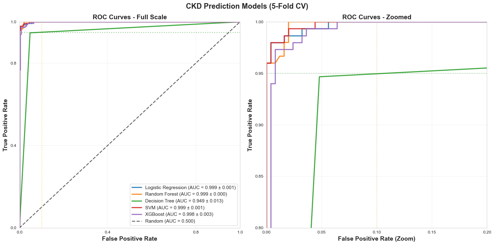
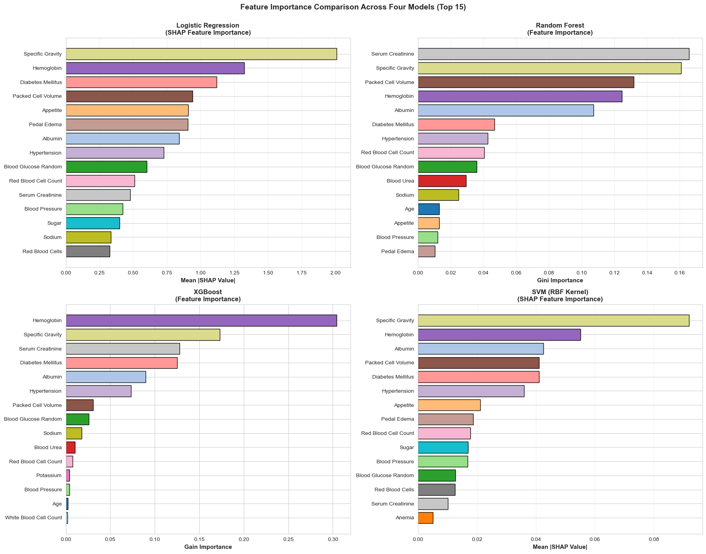

# Chronic Kidney Disease Early Detection
**A Comparative Analysis of Machine Learning Classification Models**

[](https://www.python.org/)
[](https://scikit-learn.org/)
[](LICENSE)

---

## Overview

Chronic kidney disease (CKD) affects over 850 million people worldwide and often goes undetected until it's too late. This project trained and compared five classification models to predict CKD in early stages using routine blood and urine tests. By analyzing 400 patient records with 24 clinical features, we identified the most interpretable and accurate model to enable early detection in primary care settings.

**Goal:** Enable physicians to detect CKD early so that preventative measures can be taken.

---

## Key Results

All tuned models exceeded clinical targets (Sensitivity >95%, Specificity >90%, ROC-AUC >0.95):

| Model | Sensitivity | Specificity | F1-Score | Errors |
|-------|-------------|-------------|----------|--------|
| **Logistic Regression (Recommended)** | 98.67% | 98.00% | 0.9774 | 7 |
| SVM | 98.67% | 98.80% | 0.9867 | 5 |
| XGBoost | 97.33% | 99.20% | 0.9851 | 8 |
| Random Forest | 96.00% | 99.20% | - | - |
| Decision Tree | 94.67% | 95.20% | - | - |

**Statistical Testing:** McNemar's test confirmed all top models are statistically equivalent (p > 0.05). **Logistic Regression recommended** for deployment due to interpretability despite 2 more errors than SVM.

---

## Top Predictive Features (SHAP Analysis)

Feature importance analysis across models identified:
1. **Hemoglobin** - Anemia marker (clinically validated)
2. **Specific Gravity** - Kidney concentration ability
3. **Packed Cell Volume (PCV)** - Another anemia indicator
4. **Albumin** - Protein in urine (kidney damage marker)

**Clinical Validation:** Anemia markers ranking highly aligns with CKD pathophysiology, confirming model trustworthiness.

**Note:** Serum Creatinine showed model-dependent importance (#1 in Random Forest, #11 in Logistic Regression), demonstrating the value of comparing multiple approaches.

---

## Why This Matters

- **90% of people with CKD are unaware they have it** (asymptomatic early stages)
- Disease progression causes **irreversible damage** requiring dialysis or transplantation
- **Dialysis costs $90,000+ per patient per year**
- Early intervention with medication and lifestyle changes can **slow or stop progression**
- Our models use **only routine tests** already available in primary care (no additional cost)

---

## Dataset

**Source:** [UCI Machine Learning Repository](https://archive.ics.uci.edu/dataset/336/chronic+kidney+disease) - Apollo Hospitals, India (July-Nov 2015)

- **400 patients**, 24 clinical features
- **Class distribution:** 250 CKD (62.5%), 150 Not CKD (37.5%)
- **Features:** Hemoglobin, Serum Creatinine, Blood Urea, Albumin, Specific Gravity, Blood Pressure, Age, etc.
- **Missing data:** 10.12% (handled with kNN imputation)

---

## Methodology

### Pipeline
1. **EDA:** Correlation analysis, distribution plots, outlier detection (IQR method)
2. **Preprocessing:** kNN imputation (k=5), LabelEncoder, StandardScaler, outlier retention (clinical significance)
3. **Modeling:** 5 algorithms with 5-fold stratified cross-validation using scikit-learn pipelines
4. **Optimization:** GridSearchCV with F1-scoring (balanced performance)
5. **Evaluation:** Comprehensive metrics + McNemar's statistical testing + SHAP interpretability

### Key Design Decisions
- **StandardScaler** over MinMaxScaler (robust to outliers, better for LR/SVM)
- **5-fold CV** over train/test split (small dataset, reduces variance, maximizes data use)
- **kNN imputation** (preserves feature relationships vs. simple mean/median)
- **Retained outliers** (clinical data - extreme values can indicate severe disease)
- **F1-optimization** (balanced Sensitivity/Specificity vs. Recall-only which produced 37 errors)

---

## Visualizations

### Key Results


*Dataset distribution: 250 CKD cases (62.5%) vs 150 Not CKD (37.5%)*


*Feature correlations after preprocessing - Hemoglobin (0.77), PCV (0.74), RBC (0.70) show strongest correlation*


*ROC curves comparison showing all models achieve >0.95 AUC with zoomed inset for top-left corner*


*Confusion matrices for all five models - LR: 7 errors, SVM: 5 errors, XGBoost: 8 errors*


*Top 15 features across four models (LR, RF, XGBoost, SVM) - Hemoglobin and Specific Gravity consistently rank highest*


*SHAP beeswarm plot for Logistic Regression showing feature value impact on predictions*

*See `/results/` for all 18 visualizations and detailed analysis*

---

## Technologies Used

**Languages & Libraries:**
- Python 3.8+
- scikit-learn (ML models, pipelines, cross-validation, GridSearchCV)
- SHAP (feature importance & model interpretability)
- pandas, numpy (data manipulation)
- matplotlib, seaborn (visualization)
- XGBoost (gradient boosting)

**Methods:**
- 5-fold stratified cross-validation
- kNN imputation
- Hyperparameter tuning (GridSearchCV)
- Statistical testing (McNemar's test)
- SHAP value analysis

---

## Project Structure

```
Chronic-Kidney-Disease-Early-Detection/
├── README.md                                    # Project overview and results
├── .gitignore                                   # Git exclusions
├── LICENSE                                      # MIT License
│
├── notebooks/
│   ├── 01_EDA_and_Preprocessing.ipynb          # Data exploration and cleaning
│   ├── 02_Model_Training_and_Evaluation.ipynb  # Model training and comparison
│   └── 03_SHAP_Analysis_and_Interpretation.ipynb # Feature importance and tuning
│
├── data/
│   ├── ckd_full.csv                            # UCI CKD dataset
│   └── README.md                               # Data dictionary and feature descriptions
│
├── results/
│   ├── README.md                               # Complete results documentation
│   │
│   ├── CSV Files (5 files):
│   │   ├── dataset_summary_table.csv           # Dataset statistics
│   │   ├── missing_data_summary.csv            # Missing data patterns
│   │   ├── model_comp_results.csv              # Raw model metrics
│   │   ├── detailed_model_metrics.csv          # Formatted metrics with targets
│   │   └── hyperparameter_tuning_summary.csv   # Tuning results
│   │
│   ├── EDA Visualizations (7 plots):
│   │   ├── class_balance.png
│   │   ├── Missing_Data_HeatMap.png
│   │   ├── Correlation_matrix_of_numeric_features.png
│   │   ├── Distribution_of_Key_Numeric_Features_by_CKD_Status.png
│   │   ├── Categorical_Features_Distribution_by_CKD_Status.png
│   │   ├── Serum_Creatinine_Distribution_Analysis.png
│   │   └── Correlation_Matrix_After_kNN_Imputation.png
│   │
│   ├── Model Performance (2 plots):
│   │   ├── ROC_Curves.png
│   │   └── Confusion_Matrices_All_Models.png
│   │
│   ├── SHAP Analysis (6 plots):
│   │   ├── Feature_Importance_Logistic_Regression_SHAP.png
│   │   ├── Feature_Importance_Comparison.png
│   │   ├── shap_beeswarm_lr.png
│   │   ├── shap_beeswarm_rf.png
│   │   ├── shap_beeswarm_xgb.png
│   │   └── shap_beeswarm_svm.png
│   │
│   ├── Hyperparameter Tuning (3 plots):
│   │   ├── hyperparameter_validation_curves.png
│   │   ├── xgboost_estimators_comparison.png
│   │   └── mcnemar_test_visualization.png
│   │
│   └── Trained Models (excluded from Git):
│       ├── best_lr_model.pkl                   # Logistic Regression
│       ├── best_svm_model.pkl                  # SVM
│       └── best_xgb_model.pkl                  # XGBoost
│
└── docs/
    ├── project_proposal.pdf                    # Full technical report
    └── presentation_slides.pdf                 # Project presentation
```

**Total:** 3 notebooks, 5 CSV files, 18 visualizations, 2 PDF documents

---

## How to Run

### 1. Clone Repository
```bash
git clone https://github.com/RBaraka/Chronic-Kidney-Disease-Early-Detection.git
cd Chronic-Kidney-Disease-Early-Detection
```

### 2. Install Dependencies
```bash
pip install -r requirements.txt
```

### 3. Run Notebooks
Open Jupyter and run notebooks in order:
```bash
jupyter notebook
```
- Start with `01_EDA_and_Preprocessing.ipynb`
- Then `02_Model_Training_and_Evaluation.ipynb`
- Finally `03_SHAP_Analysis_and_Interpretation.ipynb`

---

## Key Findings & Recommendations

### Clinical Insights
1. **All models exceeded performance targets** - CKD prediction is feasible with routine tests
2. **Logistic Regression identified as optimal** - balances accuracy with interpretability
3. **Anemia markers crucial** - Hemoglobin, PCV consistently ranked high across models
4. **Simple models work** - LR performance suggests CKD is a relatively linear classification problem

### Deployment Recommendation
**Deploy Logistic Regression (C=0.1)** for clinical use:
- ✅ 98.67% Sensitivity (catches CKD cases)
- ✅ 98.00% Specificity (limits false alarms)
- ✅ Interpretable (physicians can understand model logic)
- ✅ Fast prediction (real-time screening)
- ⚠️ Trade-off accepted: 2 more errors than SVM, but gains interpretability

---

## Future Work

- **Multi-site validation** to assess generalizability across demographics and healthcare settings
- **Temporal prediction** for CKD stage progression modeling
- **Real-world pilot studies** in primary care clinics
- **EHR integration** with automatic screening and risk stratification (Low/Medium/High)
- **FDA clearance** and integration into clinical guidelines (KDIGO, NKF)

---

## References

Key papers and resources used in this project:

1. Aljaaf, A.J., et al. (2021). Early Prediction of Chronic Kidney Disease Using Machine Learning. *IEEE Congress on Evolutionary Computation (CEC)*.
2. Caruana, R., et al. (2015). Intelligible Models for HealthCare. *Proceedings of KDD '15*, 1721–1730.
3. Chen, T. & Guestrin, C. (2016). XGBoost: A Scalable Tree Boosting System. *Proceedings of KDD '16*, 785–794.
4. Dua, D. & Graff, C. (2019). UCI Machine Learning Repository. University of California.
5. Pedregosa, F., et al. (2011). Scikit-learn: Machine Learning in Python. *Journal of Machine Learning Research*, 12, 2825–2830.

*Full reference list available in `/docs/project_proposal.pdf`*

---

## Acknowledgments

We acknowledge the **UCI Chronic Kidney Disease dataset from Apollo Hospitals, India**, which made this research possible. This project was completed as part of the Data Science Master's program at the University of Colorado Boulder.

---

## Contact

**RB**  
Data Science Graduate Student  
University of Colorado Boulder  
[GitHub](https://github.com/RBaraka) | [LinkedIn](https://www.linkedin.com/in/reem-baraka)

---

## License

This project is licensed under the MIT License - see the [LICENSE](LICENSE) file for details.

---

**⭐ If you found this project helpful, please consider starring the repository!**
